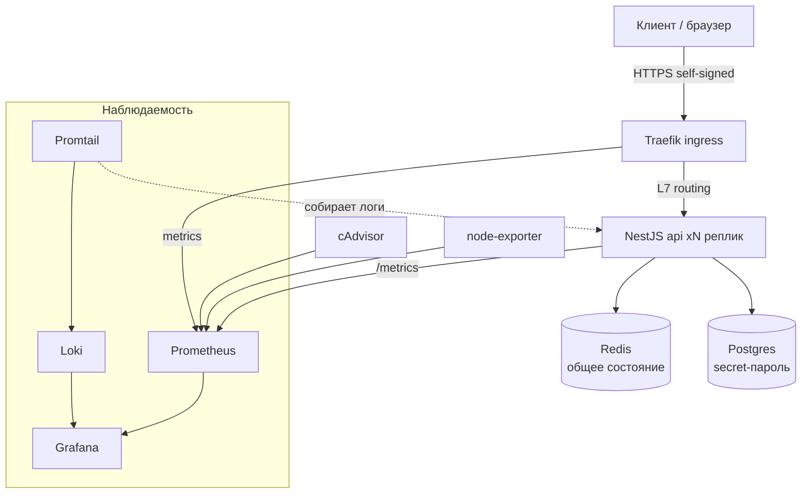

# feat: Учебный проект NestJS + Docker Swarm (пошагово, с best practices)

## Summary

План сборки учебного репозитория из origin-требований: один эволюционирующий NestJS-проект, который через четыре части (деплой и обновления → секреты → наблюдаемость → multi-node capstone) наращивается по одному сервису за раз. Каждая глава реализуется как отдельный implementation unit (главы `docs/chapters/` + изменение кода/стека + git-тег `step-NN`); код приложения пишется по TDD, инфраструктурные шаги доказываются наблюдаемым результатом из acceptance-примеров origin-документа.

---

## Problem Frame

Читатель знает Docker/Compose, но не понимает переход к оркестрации (масштабирование, обновления без даунтайма, секреты, наблюдаемость, отказоустойчивость). Подробный разбор мотивации — в origin-документе (см. Sources & References). План отвечает на «как собрать материал», а не «зачем он нужен».

---

## Requirements

Трассируются к origin-документу `docs/brainstorms/nestjs-docker-swarm-tutorial-requirements.md` (R-ID сохранены 1:1).

**Структура и подача**
- R1. Git-репозиторий с аннотированным тегом `step-NN` на каждый запускаемый шаг; одно эволюционирующее код-дерево.
- R2. Нумерованные главы в `docs/chapters/` + README-оглавление; каждый шаг воспроизводим (команды + наблюдаемый результат).
- R3. Построчный разбор каждого stack/compose-файла; в каждой главе явно названы best practices и анти-паттерны.

**Базовое приложение**
- R4. Минимальный NestJS-сервис с наблюдаемой поверхностью (hostname+версия, `/health`, позже Redis/DB-endpoint'ы); multi-stage Dockerfile (non-root, минимальный рантайм).
- R5. Конвенции проекта: Configify (конфиг), Prisma (Postgres), TDD, ESLint+Prettier.

**Часть 1 — Деплой и обновления**
- R6. `compose` → `swarm init` → первый `stack deploy`, с объяснением разницы.
- R7. Масштабирование до N реплик с наблюдаемой балансировкой (hostname); overlay + service discovery.
- R8. Redis как общее состояние при масштабировании; Traefik как ingress с self-signed TLS.
- R9. Healthcheck + restart policy; rolling update (parallelism/delay/order) + автоматический rollback без даунтайма.

**Часть 2 — Секреты и конфиги**
- R10. Арка «наивно → правильно»: Postgres с env-паролём → перевод на docker secret (файл, не env).
- R11. NestJS читает секреты из файлов через Configify; configs для несекретной конфигурации; принцип минимальной экспозиции (ротация — за скобками).

**Часть 3 — Наблюдаемость**
- R12. Prometheus (метрики приложения `/metrics`, Traefik, узла) + Grafana с дашбордами.
- R13. Централизованные логи; диагностика типовых проблем по метрикам/логам.

**Часть 4 — Capstone multi-node**
- R14. VM-узлы (manager + workers), инициализация и join; локальный registry для раздачи образов.
- R15. Placement (constraints/preferences), распределение реплик, роли manager/worker и кворум.
- R16. Failover (падение/восстановление узла), `drain` для обслуживания; перенос полного стека на кластер.

**Origin actors:** A1 (Учащийся / читатель)
**Origin flows:** F1 (Прохождение одного шага)
**Origin acceptance examples:** AE1 (балансировка по hostname → R7), AE2 (zero-downtime + rollback → R9), AE3 (healthcheck пересоздаёт реплику → R4, R9), AE4 (пароль не виден в открытом виде → R10, R11), AE5 (переезд задач при отказе узла → R16)

---

## Scope Boundaries

Перенесено из origin-документа (продуктовые non-goals):

- CI/CD-пайплайн (автосборка/публикация образов) — за скобками.
- Реальный публичный TLS (Let's Encrypt, реальный домен) — за скобками; для обучения self-signed.
- Бэкап/восстановление и стратегии миграции данных Postgres сверх базового — за скобками.
- Облачный деплой (узлы в облаке, managed-инфраструктура) — только локально.
- Сравнение/миграция на Kubernetes — за скобками.
- Автоскейлинг и автоматическая ротация секретов — за скобками (упоминаются как «дальше»).

### Deferred to Follow-Up Work

- Глава-расширение «production-hardening чеклист» (сводный) — отдельная итерация после Части 4, если потребуется.
- Перевод материалов на английский — отдельная задача (план предполагает русский).

---

## Context & Research

### Relevant Code and Patterns

- Greenfield: репозиторий пуст, локальных паттернов для наследования нет. Код приложения следует конвенциям из `~/.claude/CLAUDE.md` (Configify, Prisma, TDD, ESLint/Prettier) и стандартной структуре NestJS (`src/`, `test/`, `prisma/`).
- NestJS-скиллы (`nestjs-builder`/`nestjs-expert`, `nestjs-configify`, `nestjs-prisma`) применяются при реализации соответствующих юнитов — обязательны по конвенциям проекта.

### Institutional Learnings

- `docs/solutions/` отсутствует (greenfield) — институциональных заметок нет.

### External References

- Docker Swarm mode (services, stacks, secrets/configs, placement, rolling updates, `node update --availability drain`), Traefik (Swarm provider, TLS), Prometheus/Grafana/cAdvisor/node-exporter, Grafana Loki + Promtail, Multipass. Версии тулинга проверены в среде: Docker 29.5, Compose v5.1, Node 22.

---

## Key Technical Decisions

- **Инструмент VM = multipass** (не Vagrant/lima): лёгкий, скриптуемый, кросс-платформенный, работает на Linux; provisioning в `deploy/vms/`. Vagrant/lima — допустимая замена, но multipass даёт минимальный порог.
- **Агрегация логов = Loki + Promtail**: единая панель с Grafana (одна точка наблюдения), вместо «голого» `docker service logs`/json-file. Держим минимальной (2 сервиса), чтобы не раздувать стек (оговорка origin).
- **Тестовая постура раздельная**: код приложения — TDD (Jest, дефолт NestJS); инфраструктурные шаги (stack deploy, scaling, placement, failover) проверяются наблюдаемым результатом из acceptance-примеров, а не юнит-тестами — их нельзя осмысленно покрыть unit-тестом.
- **Доменная форма приложения = минимальный REST-ресурс на Prisma** (ресурс «notes»): даёт Postgres/секретам реальный объект для работы, оставаясь простым. Плюс служебные endpoint'ы наблюдаемости (`/`, `/health`, `/metrics`).
- **Аккреция компонентов по одному**: каждый новый сервис вводится в той главе, где иллюстрирует конкретную тему Swarm (см. origin Key Decisions).
- **Postgres появляется в Части 2** (а не в Части 1): Часть 1 фокусируется на stateless-масштабировании (NestJS + Redis + Traefik); БД и арка секретов — ядро Части 2.
- **Эволюционирующие stack-файлы в `deploy/stacks/`**: по одному файлу на часть (`stack.part1.yml` … `stack.part4.yml`), нарастающие; единый код-дереве + git-теги фиксируют состояние каждого шага (origin Key Decision).

---

## Open Questions

### Resolved During Planning

- Инструмент VM: **multipass** (см. Key Technical Decisions).
- Агрегация логов: **Loki + Promtail** (см. Key Technical Decisions).
- Место Traefik: вводится в **конце Части 1** (U6), после демонстрации встроенного routing mesh Swarm — глава объясняет, что mesh даёт L4-балансировку, а Traefik добавляет L7-маршрутизацию и TLS.
- Набор exporter'ов: **cAdvisor** (метрики контейнеров) + **node-exporter** (метрики узла) + `/metrics` приложения через библиотеку Prometheus для NestJS.

### Deferred to Implementation

- Точные библиотеки приложения (Prometheus-интеграция для NestJS, Redis-клиент) — выбрать при реализации соответствующих юнитов, следуя актуальным версиям и NestJS-скиллам.
- Конкретные дашборды Grafana (готовые JSON vs минимальные собственные панели) — подобрать в U10, провижинить декларативно.
- Точные параметры `update-config`/`rollback_config` и `healthcheck` (интервалы, ретраи) — финализировать в U7 при проверке zero-downtime.
- Сетевые детали multipass (bridged vs NAT, как объявить `advertise-addr`) — уточнить в U12 по факту окружения.

---

## Output Structure

    docker-swarm-nestjs-demo/
    ├── README.md                      # оглавление курса, предпосылки, карта 4 частей, конвенция тегов
    ├── package.json / tsconfig / .eslintrc / .prettierrc / jest config
    ├── src/                           # NestJS-приложение
    │   ├── main.ts
    │   ├── app.module.ts
    │   ├── config/                    # Configify @Configuration-классы
    │   ├── health/                    # /health
    │   ├── observability/             # / (hostname+версия), /metrics
    │   ├── shared-state/              # Redis-endpoint (счётчик/кеш)
    │   └── notes/                     # минимальный REST-ресурс (Prisma)
    ├── prisma/
    │   └── schema.prisma
    ├── test/                          # e2e + unit (Jest)
    ├── Dockerfile                     # multi-stage, non-root
    ├── docs/
    │   ├── brainstorms/nestjs-docker-swarm-tutorial-requirements.md
    │   └── chapters/                  # 01-… … 16-… главы
    └── deploy/
        ├── compose/docker-compose.yml # локальная разработка
        ├── stacks/                    # stack.part1.yml … stack.part4.yml (нарастающие)
        ├── traefik/                   # конфиг + self-signed TLS
        ├── prometheus/                # prometheus.yml, scrape-конфиги
        ├── grafana/                   # provisioning дашбордов/datasources
        ├── loki/                      # loki + promtail конфиги
        └── vms/                       # multipass provisioning-скрипты

Дерево — декларация ожидаемой формы, не жёсткое ограничение; реализатор вправе скорректировать раскладку. Per-unit `Files` — источник истины по тому, что создаёт каждый юнит.

---

## High-Level Technical Design

> *Иллюстрирует целевую форму решения и является направляющим ориентиром для ревью, а не спецификацией реализации. Реализующему агенту трактовать как контекст, не как код для воспроизведения.*

Финальный стек (после Части 4) и точки наблюдения:

Эволюция топологии: Части 1–3 — single-node Swarm (всё на одной ноде); Часть 4 — multi-node (manager + workers на multipass-VM) + локальный registry, тот же стек распределяется по узлам.

---

## Implementation Units

Юниты сгруппированы в фазы, соответствующие частям курса. Каждый юнит = одна глава (или связная пара) + изменение кода/стека + git-тег. U-ID стабильны.

### U1. Каркас репозитория и тулинг

**Goal:** Инициализировать git-репозиторий и каркас: NestJS-приложение, линт/формат/тесты, README-оглавление, структура `docs/chapters/`, документированная конвенция тегов `step-NN`.

**Requirements:** R1, R2, R5

**Dependencies:** None

**Files:**
- Create: `package.json`, `tsconfig.json`, `.eslintrc.*`, `.prettierrc`, `nest-cli.json`, Jest config
- Create: `README.md` (оглавление, предпосылки, карта частей, как пользоваться тегами)
- Create: `docs/chapters/00-introduction.md`
- Create: `.gitignore`, `.dockerignore`

**Approach:**
- `git init`; NestJS-скаффолд по `nestjs-builder`; подключить ESLint+Prettier и Jest до написания фич.
- README фиксирует: предпосылки (Docker/Compose), карту 4 частей, схему тегов `step-NN`, как сверяться с тегом.
- Зафиксировать конвенцию: каждый последующий юнит добавляет главу в `docs/chapters/` и ставит тег.

**Execution note:** Подключить ESLint/Prettier и Jest на этом шаге; после каждого последующего юнита прогонять линтер и тесты.

**Patterns to follow:** Стандартная структура NestJS; конвенции `~/.claude/CLAUDE.md`.

**Test scenarios:**
- Test expectation: none — каркас/конфигурация; поведенческого кода нет. Проверка: `npm run lint` и `npm test` выполняются без ошибок на пустом скелете.

**Verification:**
- Репозиторий инициализирован; `npm run lint`/`npm test` зелёные; README отражает структуру курса; поставлен тег `step-00`.

---

### U2. Наблюдаемый NestJS-сервис + конфиг через Configify

**Goal:** Реализовать минимальную наблюдаемую поверхность: `GET /` (hostname контейнера + версия) и `GET /health`; конфигурация — через `@itgorillaz/configify`.

**Requirements:** R4, R5

**Dependencies:** U1

**Files:**
- Create: `src/observability/observability.controller.ts`, `src/health/health.controller.ts`
- Create: `src/config/app.config.ts` (Configify `@Configuration`)
- Create: `test/observability.e2e-spec.ts`, `src/health/health.controller.spec.ts`
- Modify: `src/app.module.ts`, `src/main.ts`
- Create: `docs/chapters/01-app-and-endpoints.md`

**Approach:**
- `/` возвращает JSON с `hostname` (из `os.hostname()`) и `version` (из конфига) — это будущий индикатор балансировки между репликами.
- `/health` — лёгкий liveness без внешних зависимостей (для swarm healthcheck).
- Конфиг через Configify (`@Configuration`/`@Value`), порт и версия — из env с дефолтами.

**Execution note:** TDD — сперва падающие тесты на контракт endpoint'ов, затем реализация.

**Patterns to follow:** `nestjs-builder` (контроллеры/модули), `nestjs-configify` (типизированный конфиг, `ConfigifyModule.forRootAsync()`).

**Test scenarios:**
- Covers AE1. Happy path: `GET /` → 200, тело содержит непустой `hostname` и `version`.
- Happy path: `GET /health` → 200, `{ status: "ok" }`.
- Edge case: при незаданной `APP_VERSION` версия принимает документированный дефолт.
- Edge case: порт читается из конфига; некорректное значение порта вызывает ошибку валидации конфига на старте (class-validator Configify).

**Verification:**
- Локально `npm run start` поднимает сервис; `/` и `/health` отвечают; тесты зелёные; тег `step-01`.

---

### U3. Multi-stage Dockerfile + локальный docker-compose

**Goal:** Контейнеризовать приложение многослойным Dockerfile (non-root, минимальный рантайм) и дать локальный `docker-compose.yml` для разработки.

**Requirements:** R4, R6 (точка старта compose)

**Dependencies:** U2

**Files:**
- Create: `Dockerfile` (multi-stage: build → slim runtime, non-root user), `.dockerignore`
- Create: `deploy/compose/docker-compose.yml`
- Create: `docs/chapters/02-dockerfile-and-compose.md`

**Approach:**
- Multi-stage: стадия сборки (deps+build), рантайм на slim-образе, прод-зависимости, непривилегированный пользователь, проброс порта.
- Локальный compose поднимает один сервис приложения; глава объясняет, что это «до Swarm».
- Построчный разбор Dockerfile и compose (R3); best practices: pin базового образа, кэш слоёв зависимостей, `.dockerignore`, non-root.

**Execution note:** Инфраструктурный артефакт — проверяется сборкой и запуском, не unit-тестом.

**Patterns to follow:** Best practices Node-контейнеризации (multi-stage, non-root).

**Test scenarios:**
- Test expectation: none — Dockerfile/compose. Проверка наблюдаемая: образ собирается, контейнер отвечает на `/health`.

**Verification:**
- `docker build` успешен; `docker compose up` поднимает сервис; `/` и `/health` доступны; образ работает non-root; тег `step-02`.

---

### U4. Swarm init, первый stack deploy, масштабирование, балансировка

**Goal:** Перейти от compose к Swarm: `swarm init`, первый `stack deploy`, масштабирование реплик, overlay-сеть, наблюдаемая балансировка по hostname.

**Requirements:** R6, R7

**Dependencies:** U3

**Files:**
- Create: `deploy/stacks/stack.part1.yml` (сервис приложения, overlay-сеть, реплики)
- Create: `docs/chapters/03-swarm-init-deploy.md`, `docs/chapters/04-scaling-and-balancing.md`

**Approach:**
- Глава 03: `docker swarm init`, `docker stack deploy -c stack.part1.yml`, разница compose↔stack (deploy-секция, реплики, режимы).
- Глава 04: `--replicas`/`deploy.replicas`, overlay-сеть, встроенный routing mesh; демонстрация балансировки — повтор запросов на `/` показывает разные hostname.
- Построчный разбор stack-файла (R3); best practices: явные имена сетей, режим replicated, pinned-тег образа.

**Execution note:** Проверяется наблюдаемым результатом; команды и вывод фиксируются в главе.

**Patterns to follow:** Docker Swarm stack-файл (`version`/`services`/`deploy`/`networks`).

**Test scenarios:**
- Covers AE1. Integration (наблюдаемая): при ≥2 репликах серия запросов на `/` возвращает разные `hostname` — балансировка видна.
- Test expectation (unit): none — оркестрация.

**Verification:**
- Стек разворачивается; `docker service ls` показывает заданное число реплик; балансировка наблюдаема (AE1); теги `step-03`, `step-04`.

---

### U5. Redis как общее состояние при масштабировании

**Goal:** Показать, что in-memory состояние ломается при нескольких репликах, и перенести его в Redis (общий для всех реплик).

**Requirements:** R8 (Redis-часть)

**Dependencies:** U4

**Files:**
- Create: `src/shared-state/shared-state.controller.ts`, `src/shared-state/shared-state.service.ts`
- Create: `src/shared-state/shared-state.service.spec.ts`, `test/shared-state.e2e-spec.ts`
- Modify: `deploy/stacks/stack.part1.yml` (добавить сервис redis + overlay), `src/app.module.ts`
- Create: `docs/chapters/05-redis-shared-state.md`

**Approach:**
- Endpoint-счётчик: сперва in-memory (демонстрация рассинхрона между репликами), затем перенос в Redis.
- Redis добавляется как сервис стека во внутренней overlay-сети (не публикуется наружу).
- Глава объясняет stateless-реплики + внешнее общее состояние; best practice: состояние вне процесса приложения.

**Execution note:** TDD на сервисе состояния (логика инкремента/чтения через Redis-клиент, замоканный в unit-тестах).

**Patterns to follow:** `nestjs-builder` (провайдер-сервис, DI Redis-клиента).

**Test scenarios:**
- Happy path: инкремент счётчика затем чтение возвращает увеличенное значение (Redis-клиент замокан).
- Integration (наблюдаемая, в кластере): при нескольких репликах счётчик консистентен между ответами разных hostname.
- Error path: при недоступном Redis endpoint возвращает корректную ошибку (5xx), а не падает.

**Verification:**
- Счётчик консистентен между репликами через Redis; unit-тесты зелёные; тег `step-05`.

---

### U6. Traefik как ingress + self-signed TLS

**Goal:** Ввести Traefik как L7-ingress перед репликами приложения, с self-signed TLS; объяснить соотношение со встроенным routing mesh.

**Requirements:** R8 (Traefik-часть)

**Dependencies:** U5

**Files:**
- Create: `deploy/traefik/` (статический/динамический конфиг, self-signed сертификат)
- Modify: `deploy/stacks/stack.part1.yml` (сервис traefik, labels на приложении, публикация 80/443)
- Create: `docs/chapters/06-traefik-ingress-tls.md`

**Approach:**
- Traefik со Swarm-провайдером, маршрутизация по labels сервиса, terminate TLS (self-signed для обучения).
- Глава противопоставляет: routing mesh = L4-балансировка портов; Traefik = L7-маршрутизация, хосты/пути, TLS, dashboard.
- Построчный разбор labels и конфигурации Traefik (R3); best practices: не публиковать сервисы напрямую, централизованный ingress.

**Execution note:** Инфраструктурный артефакт — наблюдаемая проверка (HTTPS-ответ, маршрутизация).

**Patterns to follow:** Traefik Swarm provider, deploy-labels на сервисе.

**Test scenarios:**
- Test expectation: none — ingress/конфиг. Наблюдаемо: запрос через Traefik по HTTPS (self-signed) доходит до реплик с балансировкой.

**Verification:**
- Приложение доступно через Traefik по HTTPS; прямой published-порт приложения убран; балансировка сохраняется; тег `step-06`.

---

### U7. Healthcheck, restart policy, rolling update + rollback

**Goal:** Добавить healthcheck и restart policy, настроить rolling update и автоматический rollback — обновление версии образа без даунтайма.

**Requirements:** R9

**Dependencies:** U6

**Files:**
- Modify: `deploy/stacks/stack.part1.yml` (`healthcheck`, `deploy.update_config`, `deploy.rollback_config`, `restart_policy`)
- Create: `docs/chapters/07-healthcheck-rolling-update.md`

**Approach:**
- Healthcheck указывает на `/health`; restart policy для самовосстановления.
- `update_config` (parallelism/delay/order=start-first) + `rollback_config`; демонстрация: деплой v2 без даунтайма, затем намеренно «битый» v2 → автоматический rollback к v1.
- Построчный разбор update/rollback/healthcheck (R3); best practices: start-first для zero-downtime, healthcheck как условие готовности.

**Execution note:** Наблюдаемая проверка под нагрузкой (непрерывные запросы во время апдейта).

**Patterns to follow:** Swarm `update_config`/`rollback_config`/`healthcheck`.

**Test scenarios:**
- Covers AE2. Integration (наблюдаемая): при rolling update v1→v2 непрерывные запросы не получают ошибок (zero-downtime); «битый» v2 → автоматический rollback к v1.
- Covers AE3. Integration (наблюдаемая): убийство реплики → Swarm пересоздаёт её до заданного числа.
- Test expectation (unit): none — оркестрация.

**Verification:**
- Обновление без даунтайма (AE2), rollback срабатывает, упавшая реплика восстанавливается (AE3); теги `step-07` (и при необходимости отдельный тег под rollback-демо).

---

### U8. Postgres + Prisma с «наивным» env-паролём (анти-паттерн)

**Goal:** Ввести Postgres и Prisma c минимальным REST-ресурсом `notes`; намеренно использовать пароль БД через переменную окружения, показав, почему это плохо.

**Requirements:** R10 (первая половина арки), R4 (DB-endpoint)

**Dependencies:** U7

**Files:**
- Create: `prisma/schema.prisma` (модель `Note`), `src/notes/*` (controller/service/module), `src/prisma/prisma.service.ts`
- Create: `src/notes/notes.service.spec.ts`, `test/notes.e2e-spec.ts`
- Modify: `deploy/stacks/stack.part2.yml` (копия part1 + postgres с env-паролём), `src/app.module.ts`
- Create: `docs/chapters/08-postgres-prisma-naive.md`

**Approach:**
- Минимальный CRUD `notes` через Prisma; `PrismaService` по `nestjs-prisma` (singleton, graceful shutdown).
- Стек получает Postgres c паролём через `environment:` — глава явно помечает это как анти-паттерн (пароль виден в образе/`inspect`/логах) и анонсирует исправление в U9.
- Построчный разбор сервиса Postgres в стеке (R3); volume для данных.

**Execution note:** TDD на `notes` (сервис + e2e); миграции Prisma — `migrate dev`.

**Patterns to follow:** `nestjs-prisma` (PrismaService, маппинг ошибок P2002/P2025), `nestjs-builder`.

**Test scenarios:**
- Happy path: создать заметку → она возвращается в списке; получить по id → 200.
- Edge/Error path: получить несуществующий id → 404 (маппинг `P2025`).
- Error path: создание с невалидным телом → 400 (валидация DTO).
- Integration: запись переживает рестарт контейнера приложения (данные в Postgres-volume).

**Verification:**
- `notes` CRUD работает поверх Postgres; данные персистентны; тесты зелёные; глава фиксирует анти-паттерн env-пароля; тег `step-08`.

---

### U9. Перевод на docker secrets + configs; чтение секрет-файлов в Configify

**Goal:** Исправить арку: перевести пароль БД на docker secret (монтируется файлом), научить NestJS читать секреты из файлов через Configify, вынести несекретную конфигурацию в docker configs.

**Requirements:** R10 (вторая половина), R11

**Dependencies:** U8

**Files:**
- Modify: `deploy/stacks/stack.part2.yml` (`secrets:`, `configs:`, монтирование в postgres и app; убрать env-пароль)
- Modify: `src/config/app.config.ts` (чтение значения из файла по `*_FILE`-пути), при необходимости `src/prisma/prisma.service.ts`
- Create/Modify: `src/config/app.config.spec.ts`
- Create: `docs/chapters/09-secrets-and-configs.md`

**Approach:**
- Postgres берёт пароль из `POSTGRES_PASSWORD_FILE` (docker secret); приложение собирает строку подключения из секрет-файла, прочитанного через Configify (паттерн `${VAR_FILE}` → чтение файла).
- Несекретная конфигурация — через docker `configs`; глава формулирует принцип минимальной экспозиции (какой сервис какой секрет получает); ротация — упомянуть как «дальше».
- Построчный разбор `secrets`/`configs` (R3); best practice: секреты как файлы, не env.

**Execution note:** TDD на загрузке конфига из файла (подменяемый путь к файлу-секрету в тесте).

**Patterns to follow:** `nestjs-configify` (чтение значения из файла, `parse`/трансформации), Docker secrets/configs.

**Test scenarios:**
- Covers AE4. Happy path (unit): когда задан путь к файлу-секрету, конфиг читает пароль из файла, а не из env.
- Edge case: при отсутствии файла-секрета — понятная ошибка валидации конфига на старте.
- Covers AE4. Integration (наблюдаемая): в образе, stack-файле, `service inspect`, env и логах пароль в открытом виде отсутствует — только смонтированный секрет-файл.

**Verification:**
- Приложение и Postgres работают на секрет-пароле; открытого пароля нигде нет (AE4); тесты зелёные; тег `step-09`.

---

### U10. Метрики: /metrics + Prometheus + cAdvisor/node-exporter + Grafana

**Goal:** Экспонировать метрики приложения, собрать их Prometheus вместе с метриками Traefik/контейнеров/узла, визуализировать в Grafana.

**Requirements:** R12

**Dependencies:** U9

**Files:**
- Create: `src/observability/metrics.*` (endpoint `/metrics` в Prometheus-формате), `src/observability/metrics.controller.spec.ts`
- Create: `deploy/prometheus/prometheus.yml`, `deploy/grafana/provisioning/*`
- Modify: `deploy/stacks/stack.part3.yml` (prometheus, grafana, cadvisor, node-exporter)
- Create: `docs/chapters/10-metrics-prometheus-grafana.md`

**Approach:**
- `/metrics` через Prometheus-библиотеку для NestJS (default + кастомные метрики); Prometheus скрейпит приложение, Traefik, cAdvisor, node-exporter.
- Grafana с декларативным provisioning datasource (Prometheus) и базовыми дашбордами (состояние сервисов, реплики, latency/throughput, ресурсы).
- Построчный разбор scrape-конфигов и сервисов стека (R3).

**Execution note:** TDD на endpoint `/metrics` (формат/наличие метрики); дашборды — наблюдаемо.

**Patterns to follow:** Prometheus-интеграция NestJS; Grafana provisioning.

**Test scenarios:**
- Happy path: `GET /metrics` → 200, `text/plain`, содержит известную метрику (например, счётчик HTTP-запросов).
- Integration (наблюдаемая): Prometheus показывает таргеты приложения/cAdvisor/node-exporter как `up`; Grafana отображает дашборд с живыми данными.

**Verification:**
- `/metrics` отдаёт корректный формат; Prometheus собирает все таргеты; Grafana-дашборды живые; тесты зелёные; тег `step-10`.

---

### U11. Централизованные логи (Loki + Promtail) + диагностика

**Goal:** Собрать логи сервисов в Loki через Promtail, показать их в Grafana и продемонстрировать диагностику типовых проблем по метрикам/логам.

**Requirements:** R13

**Dependencies:** U10

**Files:**
- Create: `deploy/loki/loki-config.yml`, `deploy/loki/promtail-config.yml`
- Modify: `deploy/stacks/stack.part3.yml` (loki, promtail; Grafana datasource Loki)
- Create: `docs/chapters/11-logs-and-diagnostics.md`

**Approach:**
- Promtail собирает логи контейнеров и шлёт в Loki; Loki добавлен как datasource в Grafana (единая панель).
- Глава-диагностика: сценарии «упавшая реплика», «рост latency», «нехватка ресурсов» — как увидеть их по метрикам (U10) и логам.
- Держим минимальным (2 сервиса), best practice: структурные логи, корреляция метрик и логов.

**Execution note:** Инфраструктурный артефакт — наблюдаемая проверка (логи видны в Grafana).

**Patterns to follow:** Grafana Loki + Promtail; Grafana multi-datasource.

**Test scenarios:**
- Test expectation: none — стек логирования. Наблюдаемо: логи приложения видны в Grafana через Loki; в диагностической главе воспроизведён и обнаружен хотя бы один сбойный сценарий.

**Verification:**
- Логи доступны в Grafana; диагностическая глава показывает обнаружение проблемы по метрикам+логам; тег `step-11`.

---

### U12. Поднятие VM (multipass) + формирование кластера + локальный registry

**Goal:** Поднять multi-node кластер на локальных VM (multipass), инициализировать Swarm и присоединить узлы; поднять локальный registry для раздачи образов по узлам.

**Requirements:** R14

**Dependencies:** U11

**Files:**
- Create: `deploy/vms/` (multipass provisioning-скрипты: создание VM, установка Docker, init/join)
- Create: `deploy/stacks/stack.part4.yml` (полный стек + сервис registry)
- Create: `docs/chapters/12-multinode-cluster.md`, `docs/chapters/13-registry.md`

**Approach:**
- Скрипты multipass поднимают manager + N worker, ставят Docker, выполняют `swarm init`/`swarm join` по token; глава объясняет роли и `advertise-addr`.
- Локальный registry как сервис Swarm; образ приложения пушится в registry и тянется на всех узлах; глава объясняет, почему на multi-node без registry образ не доедет до worker'ов.
- Построчный разбор provisioning и сервиса registry (R3).

**Execution note:** Инфраструктурный артефакт — наблюдаемая проверка (узлы в `node ls`, образ тянется на worker).

**Patterns to follow:** Multipass CLI; `docker swarm join`; registry как сервис.

**Test scenarios:**
- Test expectation: none — провижининг/кластер. Наблюдаемо: `docker node ls` показывает manager+workers (`Ready`); образ из registry разворачивается на worker-узле.

**Verification:**
- Кластер поднят, узлы `Ready`; registry раздаёт образ; стек разворачивается на нескольких узлах; теги `step-12`, `step-13`.

---

### U13. Placement, распределение реплик, роли и кворум

**Goal:** Показать управление размещением: constraints/preferences, распределение реплик по узлам, роли manager/worker и почему кворум менеджеров нечётный.

**Requirements:** R15

**Dependencies:** U12

**Files:**
- Modify: `deploy/stacks/stack.part4.yml` (`deploy.placement.constraints`/`preferences`, реплики)
- Create: `docs/chapters/14-placement-and-quorum.md`

**Approach:**
- Constraints (например, держать stateful-сервис на конкретной ноде) и preferences (spread по зонам/лейблам); наблюдение распределения реплик по узлам.
- Глава объясняет роли manager/worker, Raft-кворум и почему менеджеров нечётное число.
- Построчный разбор placement-секции (R3); best practice: stateful-сервисы с явным placement + volume.

**Execution note:** Наблюдаемая проверка (`service ps` показывает распределение по узлам).

**Patterns to follow:** Swarm `placement.constraints`/`preferences`.

**Test scenarios:**
- Test expectation: none — оркестрация. Наблюдаемо: реплики распределяются по узлам согласно constraints; stateful-сервис закреплён на заданной ноде.

**Verification:**
- Размещение соответствует правилам; глава объясняет кворум; тег `step-14`.

---

### U14. Failover, drain и перенос полного стека на кластер

**Goal:** Продемонстрировать отказоустойчивость (падение/восстановление узла) и обслуживание через `drain`; убедиться, что полный стек (секреты + наблюдаемость) работает в кластере.

**Requirements:** R16

**Dependencies:** U13

**Files:**
- Modify: `deploy/stacks/stack.part4.yml` (финальная версия полного стека на кластере)
- Create: `docs/chapters/15-failover-and-drain.md`, `docs/chapters/16-full-stack-on-cluster.md`

**Approach:**
- Выключение worker → переезд его задач на живые узлы → возврат узла; `docker node update --availability drain` для вывода узла без даунтайма и обратно.
- Перенос полного стека (Traefik, Redis, Postgres+secrets, Prometheus/Grafana/Loki) на multi-node; проверка работоспособности и наблюдаемости в кластере.
- Построчный разбор финального стека (R3); best practices: лимиты/резервы ресурсов, restart policy, placement stateful-сервисов.

**Execution note:** Наблюдаемая проверка (доступность сервиса во время отказа/drain).

**Patterns to follow:** `docker node update --availability`; Swarm rescheduling.

**Test scenarios:**
- Covers AE5. Integration (наблюдаемая): при выключении worker его задачи переезжают на живые узлы, сервис остаётся доступен; при возврате узла нагрузка может перераспределиться.
- Integration (наблюдаемая): `drain` выводит узел без даунтайма; полный стек (включая наблюдаемость и секреты) функционирует в кластере.

**Verification:**
- Переживание отказа узла без потери доступности (AE5); `drain`/возврат работают; полный стек живёт на кластере; теги `step-15`, `step-16`.

---

## System-Wide Impact

- **Interaction graph:** Traefik (ingress) → реплики приложения → Redis/Postgres; Prometheus/Promtail скрейпят/собирают со всех сервисов; registry — источник образов для всех узлов (Часть 4).
- **Error propagation:** недоступность Redis/Postgres → endpoint'ы возвращают 5xx, не падая (healthcheck должен оставаться честным); сбой реплики → restart policy + rescheduling.
- **State lifecycle risks:** данные Postgres — на volume с явным placement (stateful не должен «уезжать» с ноды без volume); состояние приложения вынесено в Redis (stateless-реплики).
- **API surface parity:** учебные endpoint'ы (`/`, `/health`, `/metrics`, `notes`, счётчик) одинаково ведут себя на single- и multi-node — Часть 4 не меняет контракт, только топологию.
- **Integration coverage:** ключевые свойства (балансировка, zero-downtime, секреты-в-файлах, failover) проверяются наблюдаемо через AE1–AE5, а не unit-тестами.
- **Unchanged invariants:** контракт REST-приложения и схема `notes` не меняются между Частями 1–4; меняются только конфигурация развёртывания и топология.

---

## Risks & Dependencies

| Risk | Mitigation |
|------|------------|
| Multi-node на VM поднимается тяжело / окружение не тянет несколько VM | Capstone изолирован в Части 4; Части 1–3 полностью работают на single-node. Provisioning-скрипты параметризуют число/размер VM. |
| Полный стек (8+ сервисов) перегружает машину в Части 4 | Лимиты/резервы ресурсов в стеке; возможность уменьшить реплики; наблюдаемость помогает увидеть нехватку ресурсов. |
| Loki+Promtail раздувают стек наблюдаемости | Конфиг минимальный (2 сервиса, без долгого хранения); глава помечает, где можно упростить до `docker service logs`. |
| Self-signed TLS вызывает предупреждения браузера | Явно объяснено в главе как обучающий компромисс; за скобками — реальный TLS. |
| Сетевые особенности multipass (advertise-addr, bridged/NAT) ломают join | Отложено в Open Questions (U12), решается по факту окружения; скрипты документируют выбор. |
| Дрейф версий тулинга (Docker/Traefik/Prometheus) ломает примеры | Pin версий образов в стеках; зафиксированы версии среды (Docker 29.5, Compose v5.1, Node 22). |

---

## Phased Delivery

- **Фаза 0 — Foundation (U1–U3):** репозиторий, приложение, контейнеризация, локальный compose.
- **Фаза 1 — Часть 1 (U4–U7):** Swarm, масштабирование, Redis, Traefik, обновления без даунтайма.
- **Фаза 2 — Часть 2 (U8–U9):** Postgres/Prisma и арка секретов.
- **Фаза 3 — Часть 3 (U10–U11):** метрики, дашборды, логи, диагностика.
- **Фаза 4 — Capstone (U12–U14):** multi-node, registry, placement, failover, drain, полный стек на кластере.

Каждая фаза самодостаточна и запускаема; теги `step-NN` фиксируют состояние внутри фаз.

---

## Documentation / Operational Notes

- Главы `docs/chapters/` — основной продукт; каждая содержит команды, наблюдаемый результат и построчный разбор (R3) + блок best practices/анти-паттернов.
- README — оглавление и навигация по тегам; обновляется по мере добавления глав.
- Конвенция тегов `step-NN` синхронна с главами; реализатор ставит тег по завершении юнита.

---

## Sources & References

- **Origin document:** [docs/brainstorms/nestjs-docker-swarm-tutorial-requirements.md](docs/brainstorms/nestjs-docker-swarm-tutorial-requirements.md)
- Конвенции: `~/.claude/CLAUDE.md` (Configify, Prisma, TDD, ESLint/Prettier; NestJS-скиллы обязательны)
- Внешние: Docker Swarm mode, Traefik (Swarm provider), Prometheus/Grafana/cAdvisor/node-exporter, Grafana Loki+Promtail, Multipass
- Среда (проверено): Docker 29.5, Docker Compose v5.1, Node 22, Swarm inactive
